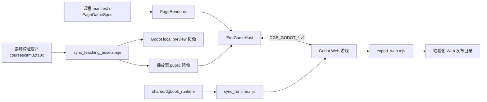

# DGBook 双游戏代码结构与交付说明

> 交付日期：2026-07-17  
> 项目范围：`ch11-band-defense`、`ch12-solar-survivor` 及其播放器接入、教学资产和 Web 发布链路  
> 交付状态：教学资产已分离；两轮分离后 Debug 已完成；修改仅保存在本地，未提交、未推送

## 1. 结论摘要

两个游戏目前共用同一套宿主协议和 Godot 运行时，但保留各自独立的玩法实现与美术资源。教学题库、升级项和课程绑定不再以发布 PCK 为权威来源，而统一由 `courses/stm32f10x` 管理，通过同步工具生成播放器公开镜像和 Godot 本地预览镜像。

当前发布链路具备以下特征：

- 播放器通过 `EduGameHost` 加载带内容哈希的 Godot Web 入口。
- Godot 先发送 `DGB_GODOT_READY`，播放器成功获取外置教学资产后才发送 `DGB_GODOT_INIT`。
- 外置教学资产缺失或结构非法时采用 fail-closed：不启动游戏，并提供重试入口。
- Godot Web 导出使用临时 staging 目录、完整性校验和原子替换，失败时保留上一版可用产物。
- 每个游戏的 HTML、JS、WASM、PCK、worklet、图标等 9 个运行文件统一使用同一个发布哈希。
- Web PCK 不包含本地教学题库、测试、MCP 插件或视觉审计文件。

## 2. 整体架构



运行时数据流：

1. `PageRenderer` 从课程页面的 `game` 配置创建稳定的 `LevelData`。
2. `EduGameHost` 创建 `godot-game` 模式并加载对应 iframe。
3. Godot 运行时发送 `DGB_GODOT_READY`。
4. 宿主按 `questionsUrl`、`upgradesUrl`、`bindingUrl` 获取并校验教学资产。
5. 宿主发送一次 `DGB_GODOT_INIT`；Godot 构造 session，并进入正式游戏状态。
6. 游戏通过 `PROGRESS`、`COMPLETE`、`LOG` 回传进度、结算和诊断信息。

## 3. 仓库级目录结构

```text
dgbook-ref/
├─ apps/player/
│  ├─ index.html                         # 播放器 HTML 壳与内联 favicon
│  ├─ public/manifest.json               # 课程页面及游戏入口配置
│  └─ public/assets/
│     ├─ courses/stm32-course/           # 教学资产公开镜像
│     └─ godot/                          # 两个游戏的哈希化 Web 发布产物
├─ courses/stm32f10x/
│  ├─ knowledge/                         # 题库与升级项权威来源
│  └─ game-bindings/                     # 课程到游戏的绑定权威来源
├─ packages/renderer-sdk/src/
│  └─ PageRenderer.tsx                   # PageGameSpec → 稳定 LevelData → 游戏弹层
├─ packages/edugame/
│  ├─ src/core/EduGameHost.tsx           # iframe、教学资产获取、协议桥接、fail-closed
│  ├─ src/modes/godot-game/              # Godot 模式、协议类型、INIT 门控
│  ├─ __tests__/                         # 宿主、协议、同步和导出测试
│  └─ godot/
│     ├─ shared/dgbook_runtime/           # 两个游戏共用的 Godot 运行时权威源码
│     ├─ tools/                           # 运行时同步、教学资产同步、Web 导出、PCK 检查
│     ├─ template/                        # 新游戏模板与协议测试
│     └─ games/
│        ├─ ch11-band-defense/
│        └─ ch12-solar-survivor/
└─ docs/deliverables/                    # 本交付文档
```

## 4. 公共宿主与运行时

### 4.1 Web 宿主层

| 文件 | 职责 |
|---|---|
| `packages/renderer-sdk/src/PageRenderer.tsx` | 将课程 `PageGameSpec` 映射为 `LevelData`；使用 `useMemo` 保持关卡对象稳定，避免页面动画重渲染打断异步 INIT。 |
| `packages/edugame/src/core/EduGameHost.tsx` | 承载 iframe；获取并校验外部教学 JSON；发送 INIT/PAUSE/RESUME/RESET；展示连接、错误和重试状态。 |
| `packages/edugame/src/modes/godot-game/protocol.ts` | TypeScript 侧协议类型、版本和消息校验。 |
| `packages/edugame/src/modes/godot-game/initGate.ts` | 保证同一 iframe 生命周期只接受一次有效 INIT；重载和卸载时令旧异步任务失效。 |
| `packages/edugame/src/modes/godot-game/GodotGameMode.ts` | 将 Godot 进度与结算接入统一游戏会话。 |

### 4.2 Godot 共享运行时

权威目录：`packages/edugame/godot/shared/dgbook_runtime/`

| 文件 | 职责 |
|---|---|
| `protocol.gd` | 定义 `DGB_GODOT_*` v1 消息；严格接受有限且数值等于 1 的整数/浮点版本。 |
| `bridge.gd` | Web `postMessage` 与本地预览桥接；发 READY/PROGRESS/COMPLETE/LOG。 |
| `knowledge_provider.gd` | 优先使用宿主注入的 questions/upgrades/bindings/concepts；本地预览时读取 fallback。 |
| `session_config.gd` | 将 LevelData 和游戏默认值合并为运行 session。 |
| `result_reporter.gd` | 约束初始化前进度、重复结算和重置行为。 |
| `runtime.gd` | 组合桥接、知识提供器、session 和结果上报，对游戏暴露统一 API。 |

`sync_runtime.mjs` 将这 6 个文件同步到 Ch11、Ch12 和模板的 `addons/dgbook_runtime/`；游戏目录中的副本是生成物，不是独立维护源。

## 5. 教学资产分离结构

### 5.1 权威数据

```text
courses/stm32f10x/
├─ knowledge/
│  ├─ ch11-band-defense.questions.json       # 30 道题
│  ├─ ch12-solar-survivor.questions.json     # 25 道题
│  └─ ch12-solar-survivor.upgrades.json      # 10 项升级
└─ game-bindings/
   └─ ch12-solar-survivor.binding.json       # 课程/模块/玩法绑定
```

### 5.2 生成目标

`sync_teaching_assets.mjs` 对每个资产计算 SHA-256，并同步到：

- `apps/player/public/assets/courses/stm32-course/...`：生产环境可获取的公开镜像。
- `games/*/data/*.local.json`：仅供 Godot 编辑器和本地预览使用。
- `games/*/teaching-assets.lock.json`：记录来源、目标和完整 SHA-256。
- 课程入口：自动写入 `?v=<sha256 前 12 位>`，实现独立缓存失效。

当前教学资产版本：

| 资产 | 数量 | 短哈希 |
|---|---:|---|
| Ch11 questions | 30 | `038e961fb803` |
| Ch12 questions | 25 | `820de774c55a` |
| Ch12 upgrades | 10 | `1ec3ff2f2a4e` |
| Ch12 binding | 1 份配置 | `c5e7887728db` |

生产 Web PCK 明确排除 `questions.local.json`、`upgrades.local.json` 和 `teaching-assets.lock.json`。因此课程资产更新可以独立于 Godot PCK 发布；生产环境也不会悄悄退回包内旧题库。

## 6. 游戏一：Ch11 Band Defense

### 6.1 定位与规模

- 项目目录：`packages/edugame/godot/games/ch11-band-defense/`
- 主脚本：`scripts/band_defense_root.gd`，约 4603 行、247 个函数。
- 类型：三关卡数据链路/频段防御塔防。
- 教学重点：I2C、滤波、峰值计步、低功耗与综合诊断。
- 教学数据：30 道外置题；波次配置仍属于玩法平衡数据，保留在游戏项目中。

### 6.2 核心结构

```text
ch11-band-defense/
├─ project.godot / export_presets.cfg
├─ scenes/main.tscn                       # 唯一主场景入口
├─ scripts/
│  ├─ band_defense_root.gd                # 状态、UI、塔/敌人、交互、结算总编排
│  ├─ wave_level_director.gd              # 关卡/波次推进
│  ├─ wave_diagnostics.gd                 # 波次与故障诊断
│  ├─ level_layouts.gd                    # 三关布局配置
│  ├─ route_geometry.gd                   # 路径几何
│  ├─ hit_feedback_fx.gd                  # 命中反馈
│  └─ symptom_fx.gd                       # 故障症状特效
├─ data/
│  ├─ waves.sample.json
│  ├─ waves.level2.json
│  ├─ waves.level3.json
│  └─ questions.local.json                # 生成的本地预览镜像，Web 不打包
├─ levels/ch11_band_defense_level.json
├─ assets/                                # 背景、塔、敌人、HUD、字体等运行资源
├─ addons/dgbook_runtime/                 # 共享运行时同步副本
├─ tests/                                 # 17 个 GDScript 测试 + Python 资产/视觉测试
└─ teaching-assets.lock.json
```

### 6.3 启动与状态流

```text
_ready
  ├─ 加载波次和布局数据
  ├─ 构建 UI / 主题 / 场景对象
  ├─ setup DGBRuntime
  └─ Web: 等待 INIT；本地预览: 使用 questions.local.json

INIT
  ├─ 获取 30 道 questions
  ├─ 构建 session / 关卡参数
  └─ 进入菜单、关卡和波次流程

游戏循环
  ├─ wave_level_director 推进波次
  ├─ route_geometry 驱动敌人路径
  ├─ 塔攻击与故障诊断
  ├─ 问题弹窗解锁/修复能力
  └─ PROGRESS / COMPLETE 回传宿主
```

Web 启动时不再探测 `questions.local.json`，避免已正确排除本地题库后仍产生“Missing JSON”警告。

## 7. 游戏二：Ch12 Solar Survivor

### 7.1 定位与规模

- 项目目录：`packages/edugame/godot/games/ch12-solar-survivor/`
- 主脚本：`scripts/solar_survivor_root.gd`，约 1961 行、96 个函数。
- 类型：追光控制主题的生存/防御教学游戏。
- 教学重点：四象限光敏、舵机 PWM、PID、死区/限幅和抗干扰。
- 教学数据：25 道题、10 项升级、1 份课程绑定，全部由宿主外置注入。

### 7.2 核心结构

```text
ch12-solar-survivor/
├─ project.godot / export_presets.cfg
├─ scenes/main.tscn
├─ scripts/solar_survivor_root.gd          # 状态机、玩法、UI、绘制与结算
├─ data/
│  ├─ questions.local.json                 # 生成的本地预览镜像，Web 不打包
│  └─ upgrades.local.json                  # 生成的本地预览镜像，Web 不打包
├─ levels/ch12_solar_survivor_level.json
├─ assets/
│  ├─ fonts/
│  ├─ v2/                                 # 背景、光球、偏移带、能量面板等
│  └─ v4_simplified/sprites/              # 当前敌人/玩家硬件模块风格
├─ addons/dgbook_runtime/
├─ tests/
│  ├─ test_runtime_integration.gd
│  └─ test_watch_debug_ui.gd
└─ teaching-assets.lock.json
```

### 7.3 状态机

```text
WAITING --收到有效 INIT--> PLAYING
PLAYING --触发教学题--> QUESTION
QUESTION --作答/超时--> PLAYING
PLAYING --通关或关机--> FINISHED
RESET -----------------> PLAYING（复用已初始化 session）
```

初始状态为 `WAITING`。Web 版不会在 INIT 前自行开始计时或生成敌人；本地预览由共享桥接延迟发出本地 INIT，仍可直接运行调试。

### 7.4 纹理资产修复

本轮浏览器 Debug 发现 Ch12 的 14 张 v2 源 PNG 只剩 `.import` 元数据，发布包因此无法加载背景和部分特效。现已从项目现存 Godot 导入缓存无损恢复源 PNG，并重新导入、重新发布。恢复内容包括 PCB 背景、光球、偏移带、能量面板、噪声脉冲、阴影云及 v2 预览/敌人资源。

## 8. Web 发布结构

工具：`packages/edugame/godot/tools/export_web.mjs`

每个游戏发布目录固定为 9 个文件，名称使用统一发布哈希：

```text
apps/player/public/assets/godot/<game-id>/
├─ index.html
├─ index.<release-hash>.js
├─ index.<release-hash>.wasm
├─ index.<release-hash>.pck
├─ index.<release-hash>.audio.worklet.js
├─ index.<release-hash>.audio.position.worklet.js
├─ index.<release-hash>.icon.png
├─ index.<release-hash>.apple-touch-icon.png
└─ index.<release-hash>.splash.png
```

当前发布信息：

| 游戏 | 发布哈希 | 文件数 | 总大小（约） |
|---|---|---:|---:|
| Ch11 Band Defense | `63b6c0e60cd2` | 9 | 91.7 MB |
| Ch12 Solar Survivor | `26482a4deb89` | 9 | 65.9 MB |

发布哈希由排序后的原始导出文件名和文件内容共同计算，不只覆盖 PCK。HTML 内的 executable、fileSizes、mainPack 和全部运行引用会同步改写。

原子发布顺序：

```text
Godot 导出到 staging
  → 文件完整性校验
  → 内容哈希与引用改写
  → 旧目录改名为 backup
  → staging 改名为正式目录
  → 成功后删除 backup
  → 任一步失败则恢复旧目录
```

Windows `.cmd/.bat` Godot 包装器通过 `ComSpec /d /q /v:off /c` 启动，避免 Node `shell: true` 的弃用与参数注入风险。

## 9. 两轮 Debug 结果

### 第一轮：自动化、静态与打包边界

| 检查项 | 结果 |
|---|---|
| `@dgbook/game` Vitest | 8 个测试文件、82 项通过 |
| TypeScript typecheck | `@dgbook/game`、`@dgbook/renderer` 通过 |
| Godot GDScript 测试 | Ch11 17 + Ch12 2 + template 3，共 22 个脚本通过 |
| Ch11 Python/pytest | 68 项通过 |
| 教学资产同步检查 | 4 个资产一致 |
| 共享运行时同步检查 | Ch11、Ch12、template 副本一致 |
| PCK 边界 | 无本地题库、测试、MCP、visual-audit 文件 |
| Player production build | 通过；仅保留既有 Vite 大 chunk 警告 |

### 第二轮：真实 Chrome 与发布链路

通过系统 Chrome 对 production `dist` 进行嵌入式运行验证：

| 游戏 | READY → INIT | 教学资产 | 控制台错误 | 请求失败/404 |
|---|---|---|---:|---:|
| Ch11 | 通过 | 30 questions | 0 | 0 |
| Ch12 | 通过 | 25 questions + 10 upgrades + bindings | 0 | 0 |

第二轮发现并修复：

- React 重渲染导致异步教学资产获取完成前 INIT token 被作废。
- Ch11 Web 包启动时仍尝试读取已排除的本地题库。
- 播放器未声明 favicon，Chrome 产生重复 404。
- Ch12 14 张 v2 源 PNG 缺失，6 张运行纹理在 Web 端报 loader error。

## 10. 本轮累计修复清单

| 类别 | 修复 |
|---|---|
| 协议 | Browser JSON 数值版本 `1.0` 合法，`1.5`、NaN/Infinity 和错误类型拒绝。 |
| 启动状态 | Ch12 在 INIT 前保持 WAITING，不提前运行。 |
| 结算 | 原生 Band/Solar 计分仅在 `godot-game` 模式启用。 |
| 发布 | staging 校验、原子替换、失败恢复；完整运行文件统一哈希。 |
| 教学资产 | 课程目录成为权威源；公开镜像、本地镜像、锁文件和 URL 哈希自动同步。 |
| 宿主安全 | 外置教学资产 503、空数组或结构错误时 fail-closed，并可重试。 |
| React 生命周期 | 稳定 LevelData；监听器更新不再误取消正在进行的 INIT。 |
| Web 边界 | Web PCK 排除本地教学资产，Ch11 不再读取 local fallback。 |
| Ch12 资源 | 恢复 14 张缺失 v2 PNG，消除 Web 纹理加载错误。 |
| 播放器外壳 | 内联 favicon，消除无关 404。 |

## 11. 常用维护命令

在仓库根目录执行：

```powershell
# 修改课程题库、升级或 binding 后
pnpm.cmd godot:teaching:sync
pnpm.cmd godot:teaching:check

# 修改共享 Godot runtime 后
pnpm.cmd godot:runtime:sync
pnpm.cmd godot:runtime:check

# 导出两个游戏（Windows 当前环境）
$env:GODOT_BIN = 'godot.cmd'
pnpm.cmd godot:web:export

# 重新构建播放器
pnpm.cmd --filter @dgbook/player build

# 宿主与发布工具测试
pnpm.cmd --filter @dgbook/game test
pnpm.cmd --filter @dgbook/game typecheck
pnpm.cmd --filter @dgbook/renderer typecheck
```

修改教学资产的正确顺序是“只改 `courses/stm32f10x` 权威源 → 运行 sync → 运行 check”；不要直接修改 public 镜像或 `data/*.local.json`。

## 12. 后续结构优化建议

本轮以可靠性和发布边界为主，没有大规模改写玩法。下一阶段建议按以下优先级渐进拆分：

1. **优先拆 Ch11 主脚本**：4603 行已经是主要维护风险。先提取 `game_state`、`tower_system`、`enemy_system`、`diagnostic_controller`、`hud_controller`，保持场景和数据格式不变。
2. **再拆 Ch12 主脚本**：把 `simulation`、`question_flow`、`upgrade_system`、`drawing`、`hud` 从 1961 行根脚本移出。
3. **将真实 Chrome 验收固化为正式 e2e**：覆盖 READY→fetch→INIT、教学资产 503、空数组、iframe reload 和双游戏控制台零错误。
4. **控制 Web 包体积**：Ch11 约 91.7 MB、Ch12 约 65.9 MB；优先审计未使用纹理、视觉审计素材和字体，而不是降低运行时校验强度。
5. **处理播放器 chunk 警告**：对 Mermaid、交互 block 和重型渲染模块做动态加载；该警告当前不影响游戏正确性。

## 13. 交付边界

- 本文描述的是 2026-07-17 本地工作区现状。
- 未执行 Git commit、push 或 PR。
- 当前未发现阻断发布的已知游戏 Bug。
- Vite 大 chunk 为非阻断性能警告，建议在下一轮性能专项中处理。

